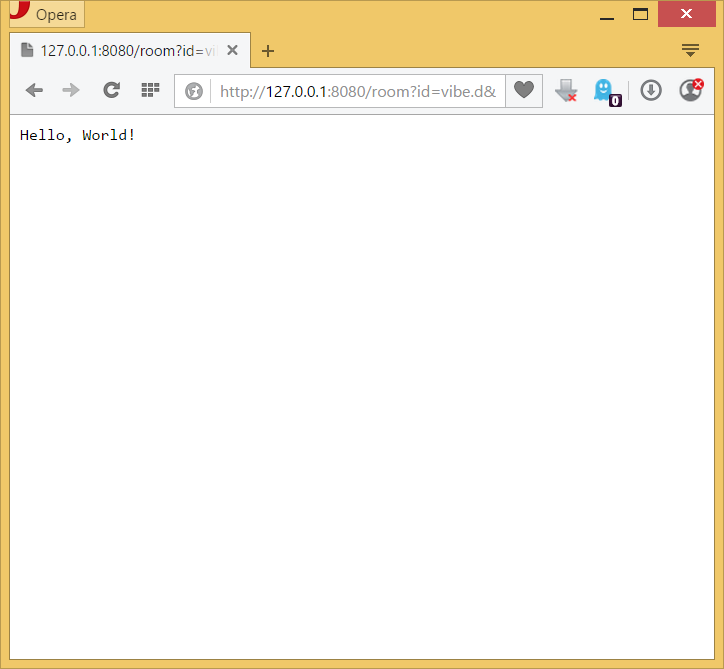
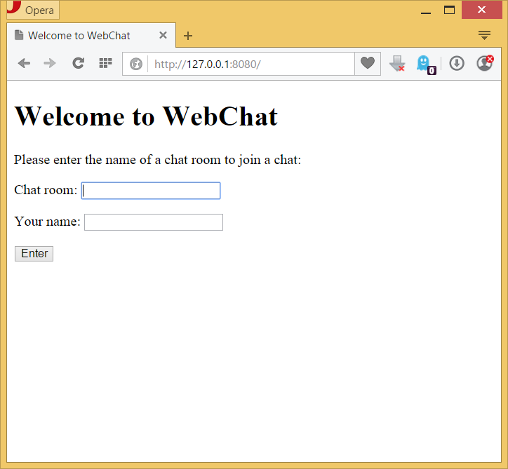
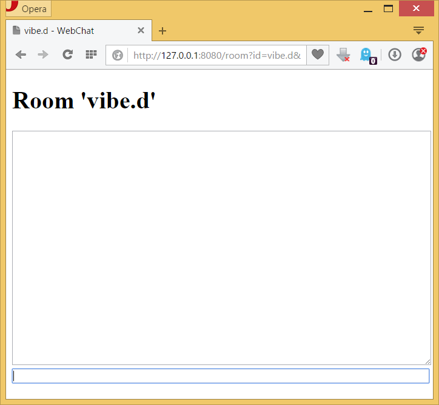
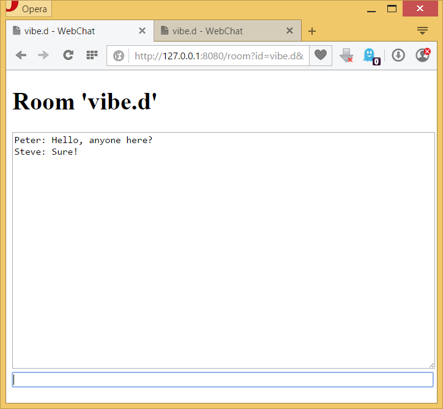

A D Tutorial: Writing a scalable chat room service
==================================================

Introduction
------------

This tutorial has been somewhat inspired by the recent [Rust in Detail: Writing Scalable Chat Service from Scratch][rust-tutorial] tutorial. However, it is set up at a slightly higher abstraction level, leveraging the functionality of vibe.d, such as its HTTP server, the WebSocket handler, the [Redis][redis] client, and its high level web application framework. For this reason we'll touch the features of the language at a higher level, without going into every little detail. The goal is to give a good overview of the application development side of D and vibe.d, leaving the peculiarities of implementing low level library functionality to more advanced tutorials.


Note: For this tutorial, the [DMD compiler](http://dlang.org/download.html), as well as the [DUB package manager](http://code.dlang.org/download) are assumed to be installed and available in `PATH`. In addition to that, a running Redis instance is required for the last two sections.

Contents
--------

1. [Why use D?](#why-use-d)
2. [Creating the project](#creating-the-project)
3. [Defining the basic application outline](#defining-the-basic-application-outline)
4. [Implementing a simple form based chat](#implementing-a-simple-form-based-chat)
5. [Incremental updates](#incremental-updates)
6. [Adding persistence](#adding-persistence)
7. [Enabling horizontal scaling](#enabling-horizontal-scaling)


Why use D?
----------

There are a lot of traits that make D a good choice for a broad range of tasks. Perhaps the biggest strength of the language is its expressiveness. It offers imperative, object oriented, functional and very powerful compile-time meta programming paradigms. Together they often open up interesting symbiotic possibilities and offer a surprisingly unrestrained environment to put ideas into practice. Something that tends to be a huge productivity boost.

The compile time features, such as static reflection, user defined attributes, (string) mixins and string imports, make it possible to do things that would typically be restricted to dynamically typed languages. The prime example in this article is the declarative web framework with support for dynamically generated HTML pages using a template language that is actually compiled into machine code together with the rest of the program.

The fact that this all works with natively compiled code and static typing means that it has an edge in performance and static code correctness over dynamically typed languages - while still being able to express ideas in the same convenient representations. Oh, any on top of the static type system, D has built-in support for unit tests and function contracts, too, so that it really facilitates writing robust code.

Similar to Rust, it also supports compiler checked memory safety, which is an important asset to have when developing web services. The main differences to Rust are that this is an opt-in feature using the `@safe` attribute, and that unfortunately support for safe borrowing and reference counting is still missing (but in the works). In case of the former, vibe.d includes a proof-of-concept implementation in the form of an [`Isolated!T`][isolated] template.

Finally, the reason for the vibe.d toolkit being born, D comes with support for fibers (aka "green threads"). Vibe.d uses those together with an event loop for doing asynchronous I/O to offer something very close to Go's goroutines, called "tasks". Huge numbers of tasks can run in the same thread, each in their own fiber. Whenever a task has to wait for some operation to finish - usually I/O, such as waiting for data from a TCP connection - it will automatically yield its fiber and lets other tasks execute instead.

But fibers use only a fraction of resources compared to a full thread and a context switch between different fibers is cheap compared to switching between threads. They also make the use of mutexes unnecessary to avoid data races, which further reduces the overhead (but there are special mutexes available to avoid higher level race conditions). For programs that are I/O bound, this means that a huge throughput can be achieved with minimum resource usage and maximum performance. But of course multi-threading can be combined with this to achieve even higher throughput, or to better distribute CPU heavy computations across CPU cores.

So let's go and take a look at how these features look in practice. Or rather, based on the clean syntax and the abstraction facilities, how *in*visible these things usually are, and thus how much one can focus on the actual problem, when implementing applications.


Creating the project
--------------------

We'll start off by invoking `dub init` on the command line:

	$ dub init webchat -t vibe.d
	Successfully created an empty project in 'C:\Users\sludwig\Develop\webchat'.

This creates a very basic vibe.d based web application skeleton that starts up a HTTP server and shows a single welcome page. The source code is in `source/app.d`:

```D
import vibe.d;

shared static this()
{
	auto settings = new HTTPServerSettings;
	settings.port = 8080;
	settings.bindAddresses = ["::1", "127.0.0.1"];
	listenHTTP(settings, &hello);

	logInfo("Please open http://127.0.0.1:8080/ in your browser.");
}

void hello(HTTPServerRequest req, HTTPServerResponse res)
{
	res.writeBody("Hello, World!");
}
```

As you can see, the code is all very straight forward and so far with few D specifics. The awkward looking function `shared static this()` is a  "module constructor" that will only be run once at application start-up. Usually you'd define a `main` function for your application to perform the initialization, but vibe.d optionally provides a default implementation, which we will be using here. It is activated using the line `versions "VibeDefaultMain"` in the generated `dub.sdl` file.

We can now run the application by simply invoking `dub` in the project directory:

```
$ cd webchat
$ dub
Performing "debug" build using dmd for x86.
Target vibe-d 0.7.23+commit.102.g911b811 is up to date. Use --force to rebuild.
Building webchat ~master configuration "application"...
Linking...
Copying files for vibe-d...
Running .\webchat.exe
Listening for HTTP requests on ::1:8080
Listening for HTTP requests on 127.0.0.1:8080
Please open http://127.0.0.1:8080/ in your browser.
```

Opening this address in the browser shows the following output:




Defining the basic application outline
--------------------------------------

Now that we have a basic web application running, we can start to add some structure and introduce different HTTP request handlers for differnet request paths. The first thing to do is to remove the `hello` function and instead add a class that will be registered as a [web interface][vibe-web]. To be able to use client side scripts and CSS files later, we'll also add a catch-all route that looks for files in the `public/` folder for any request that didn't match one of the other routes.

```D
final class WebChat {
	// GET /
	void get()
	{
		render!"index.dt";
	}
}

shared static this()
{
	// the router will match incoming HTTP requests to the proper routes
	auto router = new URLRouter;
	// registers each method of WebChat in the router
	router.registerWebInterface(new WebChat);
	// match incoming requests to files in the public/ folder
	router.get("*", serveStaticFiles("public/"));

	auto settings = new HTTPServerSettings;
	settings.port = 8080;
	settings.bindAddresses = ["::1", "127.0.0.1"];
	listenHTTP(settings, router);
	logInfo("Please open http://127.0.0.1:8080/ in your browser.");
}
```

`registerWebInterface` is the entry point to [vibe.d's high-level web application framework](vibe-web). It takes a class instance and registers each of its public methods as a route in the `URLRouter`. By default, the method names are mapped to HTTP verbs and paths automatically. The first word is converted to the HTTP method and the rest is converted from CamelCase to lower_underscore_notation to yield the path for the route. In our case, `get` is mapped to a GET request and the matched path is simply "/" because there is no further suffix in the method name. See also the [documentation for `registerWebInterface`](register-web-interface) for more details.

To make the page rendering work, we still have to add the referenced `index.dt` to the `views/` folder and fill it with some content. The file is formatted as a [Diet][diet] template, which is a [Jade][jade] dialect based on embedded D instead of JavaScript. This format removes all of the usual syntax overhead that HTML has, mainly end tags and the angle brackets, making the code much more readable.

```Diet
doctype html
html
	head
		title Welcome to WebChat
	body
		h1 Welcome to WebChat
		p Please enter the name of a chat room to join a chat:

		form(action="/room", method="GET")
			p
				label(for="id") Chat room:
				input#id(type="text", name="id", autofocus=true)
			p
				label(for="name") Your name:
				input#name(type="text", name="name")
			button(type="sumbit") Enter
```

Now, you may have noticed that the call to render the above template is using template arguments instead of normal parameters. In D, template arguments are denoted by `!`. Parenthesis can be left off if only a single argument is given.

The reason why `render` takes it's arguments as (compile time) template parameters is that Diet templates are actually translated into HTML at compile time. Using D's powerful meta-programming abilities, D code is generated that outputs static HTML code directly to the TCP socket. This means that rendering a Diet template, even if there are dynamic elements inside (see the later sections), is usually as fast as serving a static page from RAM. This means that additional caching is often not necessary.

With this in place, running `dub` and refreshing the browser now yields this:



Now let's create a second route in our `WebChat` class that handles the submitted form:

```D
void getRoom(string id, string name)
{
	render!("room.dt", id, name);
}
```

The name of this method is automatically mapped to a GET request to the path "/room". The `id` and `name` parameters mean that it will accept corresponding form fields passed through the query string. Again, we have to create the corresponding Diet template file, `views/room.dt`:

```Diet
doctype html
html
	head
		title #{id} - WebChat
		style.
			textarea, input { width: 100%; }
			textarea { resize: vertical; }
	body
		h1 Room '#{id}'

		textarea#history(rows=20, readonly=true)
		form(action="room", method="POST")
			input(type="hidden", name="id", value=id)
			input(type="hidden", name="name", value=name)
			input#inputLine(type="text", name="message", autofocus=true)
```

Note the two `#{id}` elements. These insert the contents of the `id` variable that was passed to `render` into the generated HTML code. HTML encoding is automatically used to avoid the inserted text interfering with the HTML structure (XSS attacks).




Implementing a simple form based chat
-------------------------------------

We already have a form in our `room.dt` to submit chat messages, so let's add a handler for it:

```D
void postRoom(string id, string name, string message)
{
	// TODO: store the chat message
	redirect("room?id="~id.urlEncode~"&name="~name.urlEncode);
}
```

This simply redirects back to the chat room, so that multiple messages can be posted in sequence. To get a working prototype, let's first add a simple in-memory store of the message history. Rooms will be created on-demand using the `getOrCreateRoom` helper method.

```D
final class WebChat {
	private Room[string] m_rooms;

	// ...

	void getRoom(string id, string name)
	{
		auto messages = getOrCreateRoom(id).messages;
		render!("room.dt", id, name, messages);
	}

	void postRoom(string id, string name, string message)
	{
		if (message.length)
			getOrCreateRoom(id).addMessage(name, message);
		redirect("room?id="~id.urlEncode~"&name="~name.urlEncode);
	}

	private Room getOrCreateRoom(string id)
	{
		if (auto pr = id in m_rooms) return *pr;
		return m_rooms[id] = new Room;
	}
}

final class Room {
	string[] messages;

	void addMessage(string name, string message)
	{
		messages ~= name ~ ": " ~ message;
	}
}
```

Inside `room.dt`, we can now populate the `<textarea>` with messages from the history list:

```Diet
textarea#history(rows=20, readonly=true)
	- foreach (ln; messages)
		|= ln
```

And voilà, there go our first chat messages:


Incremental updates
-------------------

Now that we have a basic chat going, let's employ some JavaScript and WebSockets to get incremental updates instead of reloading the whole page after each message. This will also give us immediate updates when other clients write messages, so that no manual page reloading is necessary. We start with a new route in `WebChat` to handle incoming web socket connections:

```D
// GET /ws?room=...&name=...
void getWS(string room, string name, scope WebSocket socket)
{
	auto r = getOrCreateRoom(room);

	runTask({
		auto next_message = r.messages.length;

		while (socket.connected) {
			while (next_message < r.messages.length)
				socket.send(r.messages[next_message++]);
			r.waitForMessage(next_message);
		}
	});

	while (socket.waitForData) {
		auto message = socket.receiveText();
		if (message.length) r.addMessage(name, message);
	}
}
```

Inside of the handler, we first start a background task that will watch the `Room` for new messages and sends those to the connected WebSocket client. Then we enter a loop to read all messages from the WebSocket. Each message is appended to the list of messages in that room.

For this to work we still have to implement `Room.waitForMessage` and add a corresponding trigger to `addMessage`:

```D
final class Room {
	string[] messages;
	ManualEvent messageEvent;

	this()
	{
		messageEvent = createManualEvent();
	}

	void addMessage(string name, string message)
	{
		messages ~= name ~ ": " ~ message;
		messageEvent.emit();
	}

	void waitForMessage(size_t next_message)
	{
		while (messages.length <= next_message)
			messageEvent.wait();
	}
}
```

`ManualEvent` is a simple entity that has a blocking `wait()` method (it lets other tasks run while waiting), which can be triggered using `emit`. Many tasks can wait on the same event at the same time.

Now that the backend is ready, we'll have to add some JavaScript to the frontend. The following file, `public/scripts/chat.js`, simply connects to our WebSocket endpoint and begins to listen for messages. Each message is appended to `<textarea>`'s contents. The `sendMessage` function will be the replacement for sending the chat message form. It sends the message over the WebSocket instead of submitting the form and then clears the message field for the next message.

```JavaScript
function sendMessage()
{
	var msg = document.getElementById("inputLine")
	socket.send(msg.value);
	msg.value = "";
	return false;
}

function connect(room, name)
{
	socket = new WebSocket("ws://127.0.0.1:8080/ws?room="+encodeURIComponent(room)+"&name="+encodeURIComponent(name));

	socket.onmessage = function(message) {
		var history = document.getElementById("history");
		var previous = history.innerHTML.trim();
		if (previous.length) previous = previous + "\n";
		history.innerHTML = previous + message.data;
		history.scrollTop = history.scrollHeight;
	}

	socket.onclose = function() {
		console.log("socket closed - reconnecting...");
		connect();
	}
}
```

This now gets integrated into `room.dt` by appending some script tags within `room.dt`'s `<body>` element:

```Diet
- import vibe.data.json;
script(src="scripts/chat.js")
script connect(#{Json(id)}, #{Json(name)})
```

The `#{Json(...)}` there uses the [JSON module](http://vibed.org/api/vibe.data.json) to wrap a string as a `Json` value and then converts that back to a string. This will create a proper quoted string that, because it's JSON, is also valid JavaScript code.

Finally, the form needs get an `onsubmit` attribute, so that the WebSocket code is used instead of actually submitting the form:

```Diet
form(action="room", method="POST", onsubmit="return sendMessage()")
```

And that's it, we now have a fast and efficient single-node multi-user chat. Still missing now is persistent storage of the chat messages using an underlying database.




Adding persistence
------------------

The final step for completing this little chat application will be to add a persistent storage instead of the ad-hoc in-memory solution that we have so far. We'll be using [Redis][redis] for this task due to its speed and feature set, and because vibe.d conveniently includes a Redis client driver. The necessary setup looks like this:

```D
final class WebChat {
	private {
		RedisDatabase m_db;
		Room[string] m_rooms;
	}

	this()
	{
		m_db = connectRedis("127.0.0.1").getDatabase(0);
	}

	// ...
}
```

Simple as that. Now let's replace the actual string array of messages with a `RedisList!string`:

```D
final class Room {
	RedisDatabase db;
	string id;
	RedisList!string messages;
	ManualEvent messageEvent;

	this(RedisDatabase db, string id)
	{
		this.db = db;
		this.id = id;
		this.messages = db.getAsList!string("webchat_"~id);
		this.messageEvent = createManualEvent();
	}

	void addMessage(string name, string message)
	{
		messages.insertBack(name ~ ": " ~ message);
		messageEvent.emit();
	}

	void waitForMessage(long next_message)
	{
		while (messages.length <= next_message)
			messageEvent.wait();
	}
}
```

As we can see, the code still looks almost the same apart from using `insertBack` instead of the `~=` operator for appending messages. `RedisList` will issue the necessary Redis commands for appending and reading of the list entries.

By the way, since in `room.dt` we are just iterating over the messages line-by-line, `RedisList` will read the reply coming from the Redis database lazily and the lines get piped directly through to the HTTP connection while the reply is read from the database. Apart from minimizing the latency of the reply, this also means that the list of messages never has to be actually stored in memory and in theory we could now pass gigabytes of chat history to the client with minimal RAM usage.


Enabling horizontal scaling
---------------------------

Now that we have a fast and persistent chat service running, there is just one thing missing from the initial promise of this tutorial: we need to enable the service to scale horizontally. With regards to the storage, this is basically already done by using a scalable database. The chat rooms can be distributed over multiple database instances, for example by using [Redis Cluster][redis-cluster]. But supposed that this application would grow to millions of users, we also need to handle the case where the web service backend itself has to be scaled by distributing requests over multiple instances (on one or multiple machines). The different instances would have to be able to notify each other about new messages, so we have to extend the basic `ManualEvent` based notification mechanism to something that works across processes.

Fortunately, Redis has a PubSub functionality that we can use here. It consists of named "channels" to which any client can send messages. All clients connected to the database can then subscribe to one or more of those channels and will each receive these messages. For our use case, to keep things simple, we are going to use a single channel to which we will send the names of the rooms that got new messages.

```D
final class WebChat {
	private {
		// ...
		RedisSubscriber m_subscriber;
	}

	this()
	{
		// ...

		m_subscriber = RedisSubscriber(m_db.client);
		m_subscriber.subscribe("webchat");
		m_subscriber.listen((channel, message) {
			if (auto pr = message in m_rooms)
				pr.messageEvent.emit();
		});
	}

	// ...
}

final class Room {
	// ...

	void addMessage(string name, string message)
	{
		this.messages.insertBack(name ~ ": " ~ message);
		this.db.publish("webchat", id);
	}

	// ...
}
```

All that is necessary to make this work is to publish the name of the chat room as a message in `Room.addMessage` instead of directly triggering `messageEvent`, as well as setting up a subscriber for that channel. `subscriber.listen()` will start a new background task that waits for new messages to arrive in the "webchat" channel and then calls the supplied delegate for each message. Within this callback we simply trigger the `messageEvent` of the corresponding `Room`, and we are done.


Open topics
-----------

- Authentication
- Redis setup/multiple instances
- Benchmarking
- Timestamps
- Styling
- HTTP/2

[rust-tutorial]: http://nbaksalyar.github.io/2015/07/10/writing-chat-in-rust.html
[vibe-web]: http://vibed.org/api/vibe.web.web/
[isolated]: http://vibed.org/api/vibe.core.concurrency/makeIsolated
[register-web-interface]: http://vibed.org/api/vibe.web.web/registerWebInterface
[diet]: http://vibed.org/templates/diet
[jade]: http://jade-lang.com/
[redis]: http://redis.io/
[redis-cluster]: http://redis.io/topics/cluster-tutorial